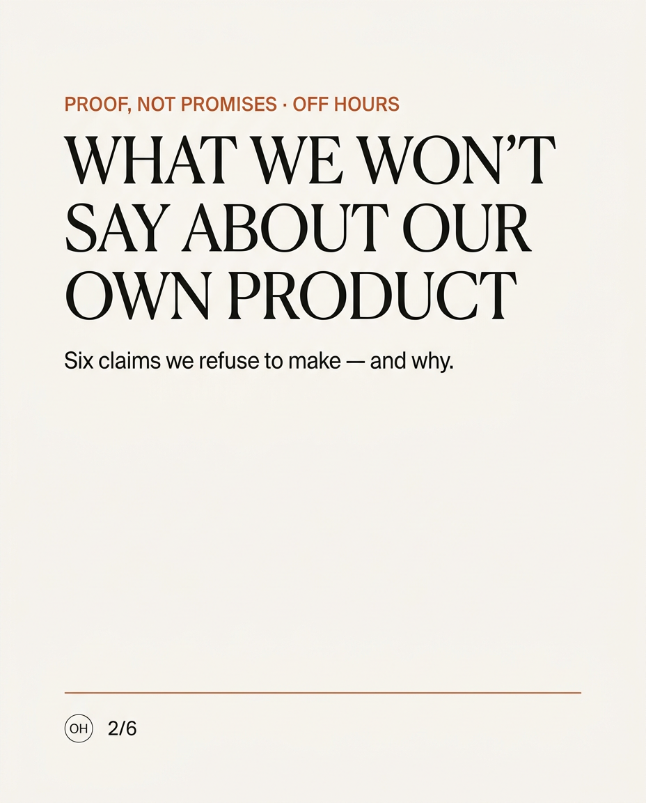
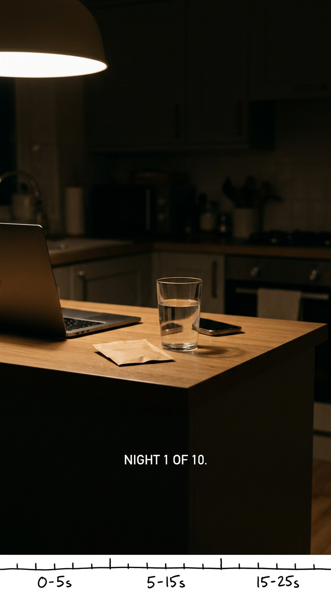

# OFF HOURS — Assignment 2: Content & Social Media Strategy
### Continuation of the Assignment 1 deck · *What begins when work ends.*

**Brand:** Off Hours — D2C sleep & recovery, melatonin-free night-drink sachets (magnesium + L-theanine + chamomile)
**Market:** Mumbai + Bengaluru, phase 1 · **Business goal:** 1,000 paying subscribed households within 12 months
**Persona:** Meera Nair, 32, Product Manager, Bengaluru — trials first, reads ingredients, cancels in one click
**Slides in this document:** P2-01 to P2-12 (continuing the Assignment 1 deck)

---

## P2-01 · Content Marketing Objective

### What content needs to achieve

> **Make Off Hours the brand people go to when the evening won't switch off — and make the 10-night trial feel like the obvious next step.**

### The two primary objectives

**1. Build awareness — of the ritual, not of a product claim**
Content puts the *evening problem* in plain words at the moment it happens, and shows a simple, non-medical landing. Awareness for Off Hours is recognition of a moment, not recall of a logo.

**2. Educate consumers — own the ingredient question**
Meera checks ingredients and reviews before any ingested product. The brand that answers those questions honestly — in its own voice — is the brand that passes the trust gate and gets the ₹999 trial.

### Why these two, and why not more

| Candidate objective | Decision | Reason |
|---|---|---|
| Build awareness | **Primary** | The category is young and the audience does not yet believe it has this problem. Awareness of the *moment* is the entry condition for everything else. |
| Educate consumers | **Primary** | The trust gate for an ingested product is the ingredient question. Education is also how a non-medical brand earns authority it cannot buy. |
| Generate engagement | Secondary | Engagement is a means here, not a goal. It converts to value only when it is conversational — questions and check-ins, not comment volume. |
| Build community | Secondary | Community is Phase 2 in our own plan and it works only two-way. Making it a headline objective now would pull the calendar toward broadcast behaviour. |
| Generate website traffic | Secondary | Traffic matters, but the primary conversion is the trial on our own storefront, fed by discovery and depth — not by traffic for its own sake. |
| Support conversion | Secondary | Conversion is the *next* step after this content has done its job. It stays measured, not led with. |

**Why this matters for this brand and this audience.** Off Hours does not sell sleep — it competes with the habit of not switching off. That competitor is a behaviour, and behaviour is changed by recognition and repetition, not by claims. Meera needs to recognise her own 10 pm in the content before she will trust a sachet at 11 pm. Awareness gives her the recognition; education gives her the permission to try.

---

## P2-02 · Brand Story & Communication

### The core brand message — one idea

> # **A landing, not a pill.**

What begins when work ends is not another task to be good at. Off Hours is the small, simple landing at the end of a day that would not stop. This is the one idea every piece of content should strengthen, and the reason the brand competes with the *habit of not switching off* rather than with pharmacies.

### Tone of voice — four characteristics

| Characteristic | What it means in practice |
|---|---|
| **Calm** | Never urgent, never a countdown. The evening is not a sale to be closed. |
| **Plain-spoken** | Ingredient answers in ordinary words. No clinical jargon, no wellness poetry. |
| **Evidence-led** | We show the label, the quantity, the reason. We say "here is what it does" and never "here is what you'll feel". |
| **Quietly warm** | As if to one tired person, not to a market. We credit the reader with intelligence and fatigue. |

### Communication principles — always and never

**Always:** simple · useful · specific · honest about limits · one idea per piece · crediting the reader's own experience
**Never:** preachy · alarmist · medical-sounding · judgmental about how someone spends their evening · urgent-for-the-sake-of-it · competitive sneering

*About the energy of our own category:* sleep content is often either clinical or mystical, and product content is often loud. Off Hours is the third register: **a firm that speaks like the calm friend who actually reads labels.** The loud register is not a growth asset for an ingested product it is the exact thing that makes Meera sceptical of gummies after one bad experience.

### Sample copy — five lines that demonstrate the register

1. **"You don't have a sleep problem. You have a landing problem."**
2. **"Magnesium, L-theanine, chamomile. That's the whole list — read it on the pack."**
3. **"No countdown. No streak. Miss a night if you need to."**
4. **"The 10 pm scroll isn't a character flaw. It's an unfinished evening."**
5. **"We're not asking you to sleep earlier. We're asking you to land better."**

---

## P2-03 · Content Pillars

Five pillars. Each carries a function — none is a bucket called "product" or "fun".

| # | Content Pillar | Purpose | Example | Why Meera cares |
|---|---|---|---|---|
| 1 | **Plain Labels** | Education & trust | "What magnesium glycinate actually does — in 40 seconds, no jargon" | She reads labels anyway; this is the brand doing her homework with her instead of at her |
| 2 | **The Landing** | Awareness & recognition | "10 pm, laptop closed, brain still on" — the moment, named | It describes her night exactly; recognition is the first kind of trust |
| 3 | **Quiet Proof** | Credibility | Unedited testimonials, including the lukewarm ones; the 10-night check-ins | She is sceptical of promises and rewards evidence; imperfection reads as honest |
| 4 | **After Hours** | Depth & loyalty | The sleep-journal letter: wind-down practices for people whose work ends late | She consumes deep content on her own time and wants the long version |
| 5 | **We Won't** | Differentiation | "Six things we refuse to say about our own product" | A brand that visibly refuses things is easier to believe; refusals are memorable |

### Why these are not generic buckets

- **Plain Labels** exists because the ingredient question *is* the trust gate for an ingested product — it is the pillar that makes the trial possible.
- **The Landing** is not "lifestyle content": it exists to put a name on the moment, which is the only way a behaviour-change brand enters the conversation.
- **Quiet Proof** is deliberately unpolished. Polished testimonials read like advertising to a review-reading sceptic; the credible version is a customer's own sentence, unedited, with edits marked.
- **After Hours** is the depth pillar, and it is the reason the audience subscribes rather than follows. Nothing in it is transactional, which is exactly why it carries the relationship.
- **We Won't** is the distinctiveness pillar: our competitor is a habit, so our content competes on standards rather than on claims.

**Rotation rule.** Every published piece belongs to exactly one pillar. We run 1 and 3 for trust, 2 for reach, 4 for belonging, 5 for differentiation. If a piece does not fit a pillar, it does not go out.

---

## P2-04 · Platform Strategy

Three primary surfaces, chosen on audience behaviour and justified against Meera — not against where brands are expected to be.

| Platform | Audience behaviour | Role for the brand | Content formats |
|---|---|---|---|
| **Instagram** | Discovery and unwinding — Meera scrolls Reels while her brain is still at the office | Awareness: name the moment, show the landing | Reels (15–30s), carousels (label explainers), Stories (polls, question boxes) |
| **YouTube** | Deeper consumption — she watches explainers and deep-dives deliberately | Education: become the brand that answers the ingredient question properly | Long-form (6–10 min), Shorts cut from the same shoot |
| **WhatsApp channel + sleep-journal e-mail** *(one private surface, two doors)* | Consented, private, read-later attention | Quiet proof, retention and belonging: the 10-day judgement window needs a guide | Plain-text notes, check-ins, short letters — no campaigns |

### Why these three for this brand

- **Instagram** is where the moment happens — she is awake at 10 pm, on the surface where short ritual content formats natively. This is the awareness engine.
- **YouTube** is where the scepticism gets resolved. Ingredient explainers need minutes, not seconds, and the audience already treats YouTube as the place to decide.
- **The private surface** is where the trial becomes a habit — the 10-day judgement window is exactly the period in which a guided, unhurried channel does the work that a public post cannot.
- **Together they behave as one loop:** discovery names the moment, depth answers the question, the private surface holds the hand through the first ten nights, and the referral link sends a friend back to discovery.

### Deliberately not in the plan

- **Television and print** — wrong age, wrong moment, unmeasurable against our conversion objectives.
- **Broad awareness bursts and mass display** — spend ahead of demand; awareness money that lands before trial intent exists.
- **Celebrity and macro-creator blitzes** — borrowed attention and the wrong trust mechanic for an ingested product.
- **Heavy marketplace-ad dependence** — a listing helps logistics; it is not where we rent our first impression.
- **Alarm-first and outrage formats** — the genres built on fear and argument. For a brand asking to be consumed at bedtime, they are structurally the wrong register, not merely off-brand.

---

## P2-05 · One Idea, Different Platforms

**The core idea:** *Night 1 of 10 — the first landing.*

> One small ritual, shown at the exact hour the audience feels the problem, and guided through the ten nights that decide whether it sticks.

| Platform | Execution | Why the execution changes |
|---|---|---|
| **Instagram** | **25-second Reel.** A kitchen at night: the laptop closed, the light down, one sachet and a glass. No voiceover, no music swell. One line on screen at the end: *"Night 1 of 10."* | The behaviour is passive scrolling at 10 pm: the idea must land visually in three seconds and be saveable for tonight. |
| **YouTube** | **6–8 minute long-form**, plus a 45-second Short. The brand walks through what is in the sachet, what each ingredient does and does not do, and how to build the ten-night habit — including what to do if you miss a night. | The behaviour is deliberate learning: here the audience wants the full answer to the ingredient question, and depth is the payoff rather than the cost. |
| **WhatsApp channel + sleep-journal e-mail** | **One plain-text note per night, ten nights.** No images, no buttons. Night 1 asks one question: *"What time did your evening actually end today?"* | The behaviour is private, opt-in attention during the judgement window. This is where a habit is carried, not a message broadcast. |

**The principle.** The *idea* never changes — one landing, shown plainly, held for ten nights. Only the behaviour changes: on Instagram you **see** it, on YouTube you **understand** it, in the private channel you **live** it for ten days. Nothing is a dead end: every piece points to the next surface, and the referral link returns a friend to the beginning of the loop.

---

## P2-06 · Content Concepts

Six concepts, each specified as **idea → pillar → platform → format → objective**.

| # | Content idea | Pillar | Platform | Format | Objective |
|---|---|---|---|---|---|
| 1 | **"What magnesium glycinate actually does — in 40 seconds"** | Plain Labels | Instagram | Carousel (5 slides) | Education + saves |
| 2 | **"We read our own label out loud"** — the founders read the pack, including the parts that are not impressive | Plain Labels | YouTube | Long-form (7 min) | Education + trust |
| 3 | **"Six things we refuse to say about our own product"** — the refusal list, one claim per slide | We Won't | Instagram | Carousel (6 slides) | Differentiation + shares |
| 4 | **"Night 1 of 10"** — the 25-second landing film | The Landing | Instagram | Reel (25s) | Awareness |
| 5 | **"The shelf"** — customers' own night-routine notes and photos, unranked, unedited, including the awkward ones | Quiet Proof | Instagram + WhatsApp channel | Carousel + plain-text note | Trust |
| 6 | **"Ask us about the label"** — the question box answered on camera, including the questions the brand dislikes | Plain Labels | Instagram Stories → YouTube Short | Q&A to video | Engagement + education |

### Two ideas developed visually

*Concept 3, "Six things we refuse to say" — carousel cover (slide 2 of 6). Design direction: warm off-white ground, one burnt-orange accent, a serif headline that behaves like an editorial page rather than an ad. No urgency device, no badge, no arrow.*

*Concept 4, "Night 1 of 10" — Reel key frame with timing margin. One continuous shot in a dim kitchen, single lamp source, hands and objects only, no faces. The last five seconds carry no music and one line of text.*

**Storyboard beats for concept 4** *(the sequence the key frame belongs to)*

| Time | Beat |
|---|---|
| 0–5s | A laptop is closed and pushed aside. Room tone only. No music. |
| 5–15s | A hand sets down one sachet and a glass of warm water. Slow, unhurried. |
| 15–25s | The sachet is opened, poured, stirred once. Camera holds. On-screen text only at the end: *"Night 1 of 10."* |

---

## P2-07 · Hero Content / Campaign Idea

**Route: Insight → Big Idea → Key Message → Execution**

### The insight
**Meera's problem is not sleep. It is the twenty minutes between closing her laptop and getting to bed.** She does not want to be told to sleep earlier, and she does not want a pill. She wants the evening to end cleanly. The scene in her head is not a bedroom — it is a lit kitchen counter, a laptop with the lid down, and the sense that the day has finally stopped.

### The big idea
> # **The 10-Night Landing**
> *A ten-night ritual campaign that turns the fortnight after the trial into the content itself.*

Instead of a launch week that shouts, the campaign runs through the brand's own 10-day judgement window. Ten nights, ten small pieces, one per night — each one a landing rather than a lesson. The audience is not invited to watch a campaign; they are invited to have ten evenings that end properly. The product arrives as the consequence of the ritual, never the reverse.

### The key message
> **"We're not asking you to sleep earlier. We're asking you to land better."**

### Execution — a four-part arc

| Beat | What happens | Where it lives |
|---|---|---|
| **1. Name the moment** | "10 pm, laptop closed, brain still on" — the evening problem, in the audience's own words | Instagram Reels, search answer pages |
| **2. Answer the question** | The label read out loud; what each ingredient does and does not do; why it is not a sleep aid | YouTube long-form, carousel explainers |
| **3. Hold the ten nights** | One plain-text note per night through the judgement window; a check-in question, not a promotion | WhatsApp channel, sleep-journal e-mail |
| **4. Let the proof speak** | Customers' unedited notes, including the lukewarm ones; the referral loop back into discovery | Instagram carousel, private channel, pack insert |

**Campaign calendar anchor.** The ten nights are the campaign clock. Everything else in the two-week plan (P2-10) either feeds a night, documents a night, or restarts the loop for the next ten.

**Why this is the right hero idea for Off Hours.** It converts the brand's own hardest metric — the trial-to-subscription window — into content; it never asks the audience to be excited, only to try; and it keeps the brand's claim discipline intact while remaining visible for ten straight nights.

---

## P2-08 · Community & Engagement Strategy

**How followers become participants:** by being asked for something they were already giving somewhere else — an honest description of their own evening.

| # | Mechanism | What it is | Why someone would participate |
|---|---|---|---|
| 1 | **Ask-the-coach, answered in public** | A recurring question box where no question is too basic, answered on camera — including the awkward ones about ingredients and side effects | It is cheap to join, there is no leaderboard to lose, and the answer is visibly *for them*. A sceptic's question being answered straight is the strongest public proof the brand can produce. |
| 2 | **The Shelf** | A rotating, unranked set of customers' night-routine notes and photos — inclusion, never competition | Being curated into a set rather than ranked against others means participation carries no risk of losing. It is the opposite of a challenge. |
| 3 | **Quiet Testimony** | Reviews and 10-night check-ins kept in the customer's own words, unedited, with any edit visibly marked | Their words stay theirs. For an audience that reads reviews before trying, being asked for a real sentence is a sign of respect. |
| 4 | **The 10-Night Check-in** | A private, opt-in nightly note during the judgement window that asks one question and expects no answer | It gives the participant a reason to stay in the loop on the worst nights — exactly when a public post would feel like noise. |

### What we deliberately do not run

- **Competitive challenges, duets and callouts** — participation built on beating someone else is the wrong register for a bedtime ritual, and it attracts the pile-on behaviour that damages an ingested brand fastest.
- **Alarm-driven live formats** — "your sleep is destroying you" content converts attention into anxiety, and anxiety is the opposite of what the brand sells.
- **Announcement broadcasts through community channels** — the community channel is for conversation. A launch message pushed through it consumes the goodwill it was meant to borrow.

---

## P2-09 · Influencer / Creator Strategy

### Who the creator should be

| Element | Recommendation |
|---|---|
| **Type of creator** | **Nano and micro (roughly 5k–75k)** — practitioners and educators, not personalities. Not macro, not celebrity. |
| **Content category** | Practical sleep and recovery education: applied sleep psychology, wind-down practice, breath-work, the physiology of switching off. No ASMR, no sleep-hack channels, no trend-jacking. |
| **Audience profile** | Over-wired professionals 25–40 in Indian metros; the same ingredient-sceptic profile as Meera — people who read before they try and who answer questions in the replies. |
| **Why they are credible for the brand** | Their authority is *method-led, not product-led*: they explain mechanisms and habits. That is precisely the authority Off Hours borrows without borrowing a claim — and it is the trust mechanic that works for an ingested product. |
| **Role in the strategy** | **Translation and proof, not reach.** Each partner takes one pillar into their own voice: the educator carries **Plain Labels**, the practitioner carries **The Landing**. They never read a script about the product; they explain the evening, and the ritual is present. |

### The fit test — four filters, applied before any conversation

| Filter | What we check | Why |
|---|---|---|
| 1 | **Teaching ratio** — is most of their content explanation rather than reaction or trend? | We are buying their habit of explaining, not their posting frequency |
| 2 | **Private-engagement ratio** — do they earn saves, questions and DM replies out of proportion to likes? | This audience's real signal is private, not public |
| 3 | **Reply tone** — do their comment threads read as questions or as arguments? | Argument threads are the register that damages ingested brands |
| 4 | **Disclosure comfort** — will they say plainly, on camera, that a piece is paid? | An undisclosed partnership is the fastest way to lose the ingredient-sceptic |

### Two recommended creators

**Creator A — Shabbir Ahmed, Sleep Psychologist** *(sleeppsychologist.in; YouTube: Sleep Psychologist)*
- **What he is:** a sleep psychologist whose practice is built on Cognitive Behavioural Therapy for Insomnia — the clinical gold standard — explicitly positioned against quick fixes and "sleep hacks". Author of *The Sleep Foundations*; MA in Psychology; doctoral research in sleep psychology; based in Navi Mumbai.
- **Audience:** adults dealing with poor sleep and burnout, and professionals seeking behavioural rather than chemical answers.
- **Why this person + why this brand:** He is the purest possible carrier of **Plain Labels**. His entire public position is "understand the mechanism, not the potion" — which is Off Hours' own claim discipline, said by someone with clinical standing. He can explain why a magnesium and L-theanine evening drink is *not* a treatment and *not* a sedative, which is exactly the boundary the brand must hold. His audience is the ingredient-sceptic who distrusts product claims; a brand that hands him the explanation rather than the script is credible to them by association.
- **Role:** flagship educator partner for the ten-night series; one long-form explainer, one Q&A, and a plain-language review of the label.

**Creator B — Shruti Maheshwari, co-founder, Sleep Gurukul** *(Mumbai)*
- **What she is:** a Mumbai-based sleep and wellbeing coach and breath-work teacher who co-founded Sleep Gurukul, an India-focused sleep and recovery practice; her work was recognised at the BW Wellbeing Festival in Mumbai for excellence in holistic wellbeing and sleep, and the practice works with both individuals and corporate wellness programmes.
- **Audience:** Indian professionals — a strongly female, metro, 25–40 skew — interested in sleep, breath-work and sustainable routines rather than gadgets.
- **Why this person + why this brand:** She carries **The Landing** — the ritual, breath-work and evening-practice side of switching off, which is the emotional half of what Off Hours sells and the half a product cannot demonstrate on its own. Her practice is India-native, not translated from Western sleep content, which matches a brand built for late-working Indian cities. And her corporate-wellness and clinic work is a direct bridge into Off Hours' Phase 2 partnerships, with a partner who already has the trust of the buyer.
- **Role:** ritual and community partner: the guided wind-down series, the breath-work pre-roll for the ten nights, and the introduction path into Phase 2 wellness programmes.

### Before we contract — three checks

1. **Category conflicts:** confirm neither partner currently works with a competing sleep or supplement brand (materially important and not yet verified).
2. **Disclosure:** agree the on-camera paid-partnership line in writing before the first shoot.
3. **Follower data:** we have deliberately not selected on follower counts — but verify current audience location (Mumbai/Bengaluru share) before activation, since Phase 1 is two-city.

---

## P2-10 · Two-Week Content Calendar

### Cadence rationale — why this frequency and not a full grid

The plan publishes **ten pieces across fourteen days, with four deliberate quiet days**, because:

- **The brand's job is a habit, not a feed.** Ten nights is the campaign clock, and each night carries one idea. More posts would dilute the sequence.
- **The judgement window is the asset.** Days 1–10 are make-or-break for a trialist; content during that window should support the *ritual*, not the campaign.
- **Two quiet days a week are a decision, not a gap.** A bedtime brand that posts anxiously at midnight contradicts itself. Silence on those days is part of the message.
- **Every week has one anchor and one visual.** The anchor carries depth (YouTube), the visual carries reach (Reels). Everything else points at one of the two.
- **Frequency follows proof.** Paid and partner content only amplifies messages the plan has already proven organically; nothing is scheduled before it has earned its place.

| Day | Platform | Content | Format | Pillar | Objective |
|---|---|---|---|---|---|
| **Week 1 — Mon** | YouTube | **Anchor:** "We read our own label out loud" | Long-form 7 min | Plain Labels | Education + trust |
| Tue | — | *Quiet day* | — | — | — |
| Wed | Instagram | "What magnesium glycinate actually does — in 40 seconds" | Carousel (5) | Plain Labels | Saves + education |
| Thu | Instagram | **"Night 1 of 10"** — the landing film | Reel 25s | The Landing | Awareness |
| Fri | Instagram | "Ask us about the label" — answers to the week's questions | Stories Q&A | Plain Labels | Engagement |
| Sat | WhatsApp + e-mail | Night 5 check-in: "What time did your evening actually end today?" | Plain-text note | After Hours | Retention |
| Sun | — | *Quiet day* | — | — | — |
| **Week 2 — Mon** | YouTube | **Anchor:** "Why this is not a sleeping pill" — the mechanism, plainly explained | Long-form 6 min | Plain Labels | Trust + consideration |
| Tue | Instagram | "Six things we refuse to say about our own product" | Carousel (6) | We Won't | Differentiation + shares |
| Wed | — | *Quiet day* | — | — | — |
| Thu | Instagram | "The shelf" — customers' own night notes, unranked | Carousel (6) | Quiet Proof | Trust + shares |
| Fri | Instagram | Short cut of Monday's anchor | Short 45s | Plain Labels | Reach |
| Sat | WhatsApp + e-mail | Night 10: "One thing that changed. One thing that didn't." | Plain-text note + referral link | Quiet Proof | Advocacy + referral |
| Sun | — | *Quiet day* | — | — | — |

**Anchor logic.** Monday anchors open the week's question; the rest of the week answers, illustrates and holds it. The two Saturday notes land inside the ten-night sequence, so the private channel carries the ritual while the public channel carries the story.

**What the plan refuses to do.** It does not post daily to look active, does not fill quiet days for the sake of the grid, and does not schedule a launch announcement into the community channel. If a week cannot support its anchor, the anchor moves — the calendar does not get filled with noise.

---

## P2-11 · Measurement & Success

### The metrics, each tied to an objective

| # | Objective | KPI | What healthy looks like | Read on |
|---|---|---|---|---|
| 1 | Awareness | **Reach**, split into Reels reach vs. search-arrival reach | Rising, with search arrivals growing faster than Reels reach | Monthly |
| 2 | Education | **Saves and returns** on label explainers | Explainers are the most-saved content of the month | Monthly |
| 3 | Education → consideration | **Video completion rate** on long-form ingredient content | Above the brand's own baseline; the "why it is not a pill" film completes best | Monthly |
| 4 | Trust | **Private interactions** — saves, DM questions, channel replies | Private response at least equal to public response | Monthly |
| 5 | Conversion support | **Trial starts from content** — attributed from discovery and search paths, at the ₹999 entry | Growing steadily; the measure that matters is *source mix*, not volume | Monthly |
| 6 | Retention | **Night-5 and night-10 check-in participation** *(the private channel)* | A meaningful share of trialists reply or stay in the sequence | Every 10 nights |
| 7 | Health / stop signal | **Argument threads and complaint mentions per cycle** | **Flat or falling — this is the negative indicator** | Monthly |

Seven metrics, each mapped to an objective, and one of them negative. A framework that cannot fail is not a framework.

### After one month — how we would know whether the strategy is working

> **It is working if** saves and returns are the rising line, private responses are at least as strong as public ones, the ten-night check-ins are being answered, trial starts are coming through discovery and search — and argument threads are flat.
>
> **It is not working if** reach is rising while saves stay flat, the check-ins go unanswered, and the comment threads have turned into arguments. That would mean the brand has drifted into the loud register, and the fix is not more volume — it is a smaller claim, said plainer.

### What would make us change the strategy

- If private interactions never exceed public ones across a full cycle, the quiet-channel investment is not paying for this audience.
- If a low-key partnership note outperforms a broadcast push in the same channel, the broadcast instinct is wrong for this brand.
- If competitive or challenge formats produce the best trust results, our refusal list is too conservative.
- If the depth films underperform the short films on **trial starts** — not on views — the education weighting changes.

### Closing line

**Strategy first. Design second. Every creative decision here has a reason — and the reason is always the same one: this brand exists to end the day, not to win the feed.**

---

## P2-12 · Continuity with Assignment 1 — what changed and what held

| Assignment 1 said | Assignment 2 does | Why |
|---|---|---|
| Retention before reach | Content sequence is built around the 10-night judgement window; reach surfaces exist to feed it | The window is where the business is won |
| Understated, proof-led launch | Voice: calm, plain-spoken, evidence-led; no countdowns, no hype | The audience punishes hype before it punishes price |
| Compete with the habit, not with pharmacies | Pillars name the *moment* and the *landing*, not the product's claims | Behaviour change needs recognition first |
| Partnerships and mass awareness delayed to Phase 2 | Community is two-way and private-first; creator programme is small, method-led practitioners; no broadcast blitz | Partnerships work when they are worth having |
| Five channel priorities | Three primary content surfaces, mapped to behaviour: discovery, depth, private | Content needs focus; the other two channels remain in their existing roles |
| 999 trial, 1,899/month | Conversion is supported by content, never pushed by it | The trial is a judgement window, not a discount event |

**Checklist coverage:** objectives (P2-01) · brand message + tone (P2-02) · five pillars (P2-03) · platform strategy (P2-04) · one idea across platforms (P2-05) · six concepts + two visual executions (P2-06) · hero campaign (P2-07) · community mechanisms (P2-08) · creator strategy + two creators (P2-09) · two-week calendar (P2-10) · measurement framework (P2-11) · continuity (P2-12).
