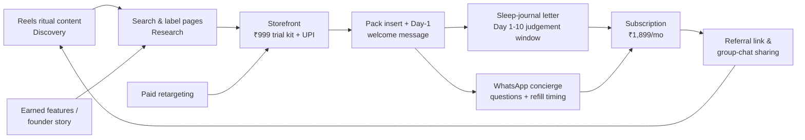

# Assignment 1 — Building a Digital Presence: Brand & Strategy Foundation
**Brand: Off Hours** · D2C sleep & recovery · Individual assignment · Submission 18 September 2026
Format: presentation deck (export to PPT / PDF / Google Slides / Canva). One deck, twelve slides.

---

## Slide 1 — Brand Introduction
- **Brand name:** Off Hours *(written name and positioning only — no logo at this stage, per brief)*
- **Category:** D2C sleep & recovery — functional night-drink sachets (melatonin-free)
- **Product / service:** 10-sachet box of a magnesium + L-theanine + chamomile night drink; refill subscription
- **Geography / market:** Mumbai + Bengaluru, India (two-city beachhead, delivery via own storefront)
- **Price positioning:** Premium-accessible — **₹999** 10-night trial kit; **₹1,899/month** subscription (planned price points)
- **One-liner:** *Off Hours — what begins when work ends.*

---

## Slide 2 — Brand Overview
- **What we offer:** a simple, drug-free wind-down ritual in a glass — one sachet, warm water, lights-low
- **Consumer problem solved:** urban professionals 25–40 finish work at 9–10 pm, still wired —
  they scroll, snack, and sleep badly; melatonin feels medical, chamomile tea feels weak
- **What makes it different:** melatonin-free ingredient-forward formula built as a *ritual*, not a pill;
  subscription refill rhythm; taste and texture designed for a work-night reality (unsweet, light)
- **Competitors / alternatives:** OTC sleep gummies and melatonin tablets; herbal/sleep teas;
  wellness apps (guided wind-downs); the default alternative — doing nothing and scrolling
- **Strategic stance:** we compete with the *habit of not switching off*, not with pharmacies

---

## Slide 3 — Business Goal
- **One primary business goal:** build a base of **1,000 paying subscribed households** within the first 12 months
  of launch in the two launch cities
- This is a business outcome (a recurring-revenue customer base), not a marketing activity — marketing's job
  (next slide) is the measurable path that gets the business there
- Why this goal: a D2C subscription business compounds on retention; a loyal base funds every later stage of growth

---

## Slide 4 — Marketing Objectives (SMART)
1. **Acquire:** ramp to a sustained run-rate of **≥600 trial-kit orders/month by month 6**, converting
   **≥12% of triallists to subscription within 30 days of trial start** (delivers ≥90 new subscribers/month
   at run-rate, incl. a ≥15% referral share) *(acquisition objective)*
2. **Retain** — by month 12, at least **60% of monthly revenue** comes from existing subscribers,
   with third-purchase repeat rate ≥ 45% *(retention objective)*
- **How these support the business goal:** ≥90 new subscribers/month at run-rate after month 6, plus the
  ramp months and ≥45% third-purchase retention, compounds to the 1,000-household base at month 12 —
  the arithmetic closes by construction; both objectives are numbered, dated, and owned

---

## Slide 5 — Target Audience
- **Demographics:** 25–40, single or young-couple households, degree-educated professionals
  (tech, finance, consulting, media), Mumbai (Powai, Lower Parel, Andheri) + Bengaluru (Indiranagar, Koramangala, HSR)
- **Income / spending power:** ₹12L+ annual household income; already pays for convenience and self-care
  (food delivery, gym apps, streaming) — ₹999 is an impulse-try, ₹1,899/mo competes with one dinner out
- **Psychographics:** evidence-seeking wellness sceptics — read ingredient lists, dislike hype,
  want better mornings more than "sleep"; identity: ambitious but burning the candle
- **Behaviour:** shops online several times a week; subscribes and cancels ruthlessly; discovers via
  short video and peer group chats; researches reviews before any ingested product; active 10 pm–1 am
- **Not our audience:** insomniacs seeking clinical treatment; price-first general supplement buyers;
  anyone outside the two cities in phase 1

---

## Slide 6 — Primary Buyer Persona — "Meera"
- **Profile:** Meera Nair, 32, product manager at a Series-B startup, Bengaluru (Koramangala), ₹18–24 LPA
- **Lifestyle:** stand-ups at 10 am, deep work at night; gym membership renewed yearly, used rarely;
  orders in 4–5 nights a week; unwinds with series + scrolls till 1 am; alarm at 7:30
- **Interests:** productivity systems, longevity content, café coffee, weekend treks
- **Goals:** wake up clear-headed without another pill; feel in control of her evenings again
- **Pain points:** 3–4 hours of "junk time" at night; groggy mornings; sceptical of gummies after one
  bad experience; hates auto-renew traps
- **Motivations:** visible morning energy, a ritual that feels like hers, evidence over promises
- **Favourite digital platforms:** Instagram Reels, YouTube deep-dives, WhatsApp groups, Reddit India
  fitness threads, and her email (she reads a good newsletter)
- **Online buying behaviour:** trials first; checks ingredients + reviews; pays UPI; will subscribe
  after one good full box; cancels in one click if annoyed
- **Quote:** *"I don't have a sleep problem — I have a switching-off problem. Show me something
  simple that actually works and I'll stick with it."*

---

## Slide 7 — Customer Journey (persona: Meera)

| Stage | Consumer behaviour | Digital touchpoints | Questions / concerns | Potential friction |
|---|---|---|---|---|
| Need / Trigger | 1:00 am, wired, dreading 7:30 alarm; resolves to fix it | late-night scroll; notes app; group chat venting | "Why can't I just switch off?" | feelings, not words — nothing to search *for* |
| Discovery | sees short-video content about wind-down rituals | Reels/shorts, creator newsletters, Reddit threads | "Is this a real category or snake oil?" | ad blindness; scepticism is high at first contact |
| Research | googles ingredients, reads label breakdowns & reviews | search, brand site, YouTube explainers, Reddit | "What's actually in it? Any habit-forming stuff?" | thin or jargon-heavy info kills trust instantly |
| Consideration | compares trial kit vs. gummies vs. tea; checks price/night | product page, reviews, comparison content, WhatsApp | "Is ₹999 for 10 nights worth it? Can I taste it?" | price framing without a per-night anchor |
| Purchase | orders trial kit; UPI one-tap; expects 2-day delivery | own storefront, UPI checkout, order confirmations | "Will it arrive before the weekend? Easy returns?" | clunky checkout; forced account creation |
| Experience | uses sachets nightly for 10 days; judges by her mornings | pack insert, refill reminders, sleep-journal letter | "Is it working or placebo? When do I decide?" | no usage guidance; silence after delivery |
| Loyalty / Advocacy | converts to subscription; tells the group chat | WhatsApp concierge, referral link, subscriber letter | "Do I get anything for staying? For sharing?" | pushy upsells; hard-to-cancel subscription = trust killer |

---

## Slide 8 — Digital Marketing Strategy (narrative)
We target over-wired professionals 25–40 in Mumbai and Bengaluru who do not believe they have a sleep
problem — and we meet them at the moment they feel it. We want them to think *"this is a simple ritual,
made for my actual nights,"* and to do one thing: try the 10-night kit. The broad approach is
**rest-and-consolidation first**: everything we do digitally exists to convert a trial into a calm,
repeatable evening habit and then into a subscription — not to chase reach.

The channels work as one loop, not a stack. Short-video and search content earn the first honest
attention and answer the ingredient questions that build trust; the storefront converts with a
low-friction ₹999 trial; then the owned layer — pack insert, WhatsApp refill concierge, the fortnightly
sleep-journal letter — carries the relationship through the 10-day judgement window and into a
subscription. Paid spend exists mainly to *re-find* people already in the loop. Brand partnerships
(company wellness programmes, clinics) arrive in phase two, once the base makes us worth partnering with.

---

## Slide 9 — PESO Media Mix
| | What it is for Off Hours | Primary job |
|---|---|---|
| **Paid** | retargeting to site visitors & video viewers; later, sponsored discovery inside quick-commerce listings once demand exists | re-find warm audiences; amplifies proven messages only |
| **Earned** | wellness editors & newsletters covering the "switch-off" culture; the brand's founding narrative — built melatonin-free for India's late-working cities | third-party credibility the ingredient-sceptic trusts |
| **Shared** | customers posting their night-routine rituals; 10-night challenge check-ins; referral links in group chats | turns the ritual into social proof; peer recommendation |
| **Owned** | storefront & product pages, WhatsApp refill concierge (opt-in), sleep-journal email letter, pack inserts | the retention spine — where trials become subscribers |

**How the four work together:** Earned and Shared create believable first contact; Owned converts and
keeps; Paid only accelerates what the other three already prove — spend follows pull, never precedes it.

---

## Slide 10 — Recommended Digital Channels (5 priorities)
| Channel | Role | Why this channel? |
|---|---|---|
| Instagram Reels + short video | Discovery | where our audience actually unwinds at 10 pm; ritual content formats natively |
| Search (brand site + category articles) | Trust & research capture | ingredient questions are the trust gate; the brand must answer them itself |
| Own storefront + UPI checkout | Conversion | low-friction ₹999 trial; owns the data the subscription model needs |
| WhatsApp concierge (opt-in) | Retention & service | user-consented, India-native, high-open — perfect for refill timing and questions |
| E-mail sleep-journal letter | Experience & advocacy | the 10-day judgement window needs a guide; letters out-sell loud campaigns |

**Named non-priorities (and why):** television & print (wrong age and wrong moment, unmeasurable);
mass display/broad awareness bursts (spend ahead of demand — awareness money lands before trial intent exists);
celebrity influencer blitzes (borrowed attention, wrong trust mechanic for an ingested product);
heavy marketplace-ads dependence (a listing helps logistics, but we refuse to rent the brand's first impression).

---

## Slide 11 — Integrated Digital Journey (one connected loop)

Every channel hands the customer to the next with context attached — nothing is a dead end, and owned
channels carry the relationship through the 10-day judgement window (Slide 7, Experience row).

---

## Slide 12 — Key Strategic Decisions
1. **Retention before reach** — the entire system is sequenced to win subscribers, not impressions:
   trial → judged experience → subscription is the value engine
2. **An understated, proof-led launch** — quiet, sharp, ritual content over launch-week hype;
   the brand earns its loud phase rather than starting with it
3. **We compete with the habit of not switching off** — positioning against an evening behaviour,
   not against pharmacies or gummies, keeps the brand distinct and the message human
4. **Partnerships and mass awareness are deliberately delayed** — alliances phase two; awareness
   spend only after pull signals exist — money and attention are spent in the order they convert

---

## Brand Selection Test (self-check, per brief)
- **What do you sell?** A melatonin-free night-drink sachet — a 10-night trial kit and a refill subscription.
- **Who is it for?** Urban professionals 25–40 in Mumbai & Bengaluru who can't switch off after late workdays.
- **What problem does it solve?** Evenings that never downshift: wired minds, junk-time scrolls, groggy mornings.
- **Why would someone choose you?** A simple, non-medical ritual with honest ingredients, fair trial pricing,
  and support through the full first 10 nights — chosen once, kept as a habit.

*Scope note (for the marker): strategy-level plan only — no campaign calendars, keyword lists, influencer lists,
media budgets, creatives, or dashboards at this stage, per the brief.*
